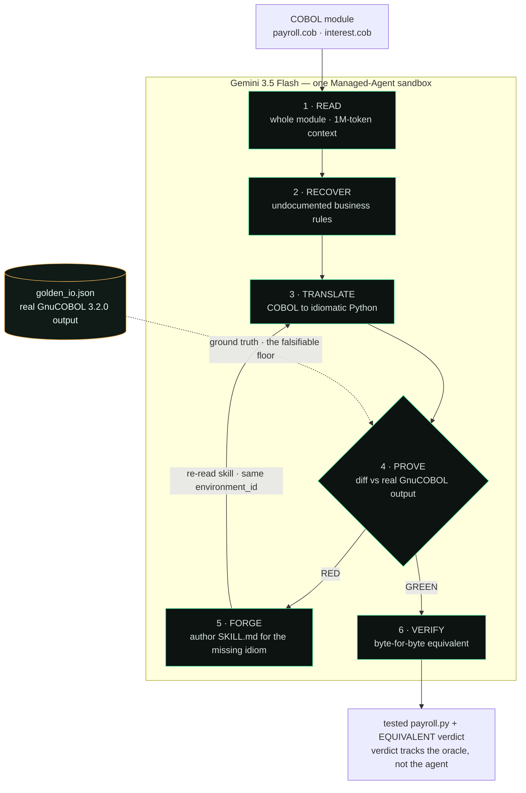

# LAZARUS — Aero-Migrate

[](https://github.com/nihalnihalani/lazarus-aero-migrate/actions/workflows/tests.yml)


> **Autonomous Legacy Modernization Engine** · Google I/O 2026 Hackathon · Gemini 3.5 Flash + Managed Agents API
>
> *Raising dead code back to life.*

LAZARUS ingests legacy **COBOL**, translates it to modern **tested Python**, and — crucially — **proves the translation is correct against the original program's real GnuCOBOL output**. When it hits a COBOL idiom it doesn't understand, it **writes itself a new skill (`SKILL.md`)** into its live sandbox and **re-reads it on the next pass of the same session**, repeating until the migrated code is byte-for-byte equivalent.

**It does not grade its own homework.** The verdict tracks a differential oracle — the real COBOL's actual output as ground truth — not the agent's own claims. A wrong module goes **RED**; that's the whole point.

---

## How it works



A live run is **genuinely live and takes ~8–9 minutes** (real sandbox, real compiler, real proof) — the runtime is the proof it isn't a canned animation. A web UI streams the agent's work the whole time (phase rail, elapsed-timer heartbeat, scrolling trace) so the screen is never frozen.

## Demo

Run the cached replay locally — **22 seconds, no API key**, built from real GnuCOBOL golden bytes:

```bash
cd web && python3 -m http.server 8080
# open http://127.0.0.1:8080/index.html?mock=1  →  click "use the sample"
```

What you'll see (each panel populated from real work):

1. **Business rules recovered** — plain-English intent + the COBOL source line, incl. the rounding **GOTCHA**
2. **COBOL → Python** — syntax-highlighted side-by-side diff, semantics preserved
3. **Proof — equivalence vs. real COBOL** — `RED → GREEN`, per-case bytes, oracle banner
4. **Forged a new skill** — the agent authoring `SKILL.md` and re-reading it

> Screenshots drop into [`docs/img/`](docs/img/) — see [`docs/img/CAPTURE.md`](docs/img/CAPTURE.md) to grab the four panels in ~2 minutes. The `?mock=1` replay is a **break-glass fallback only**; the product default is a real live run (see [`docs/DEMO_SCRIPT.md`](docs/DEMO_SCRIPT.md)).

## 1. The Problem

Government agencies and financial institutions still run on 40-year-old mainframes written in COBOL. When demand spikes, they fail catastrophically — and the engineers who can fix them have retired.

- **April 2020:** New Jersey Gov. Phil Murphy **publicly called for volunteer COBOL programmers** after the state's 40-year-old mainframe buckled under a **1,600% surge** in unemployment claims — **over 362,000 new claims in two weeks** (NJ Dept. of Labor; CNBC; WHYY).
- **U.S. tech debt cost ~$2.41 trillion in 2022** (CISQ/Synopsys, *Cost of Poor Software Quality in the US: A 2022 Report*). Developers waste **18–23%** of their time on bad code (Stripe, *Developer Coefficient*, 2018).

Manual line-by-line migration is slow, expensive, and risky. The institutional knowledge encoded in these systems is **undocumented** and dying with the people who wrote it.

## 2. The Solution

LAZARUS is a **single autonomous agent** (no fragile multi-agent orchestration) on the **Gemini 3.5 Flash Managed Agents API**. In one hosted Linux sandbox it:

1. **Reads** the whole module in one shot — Gemini 3.5 Flash's **1M-token context** scales the *same* loop from the demo slice to a **50k-line** program without chunking.
2. **Recovers the lost business logic** — explains, in plain English, the undocumented rules the COBOL encodes (the "archaeology" that makes this more than a transpiler).
3. **Translates** COBOL → idiomatic Python in the sandbox.
4. **Proves equivalence against the real compiler.** Ground truth is the **original COBOL's real GnuCOBOL output**, captured ahead of time into [`src/sample/golden_io.json`](src/sample/golden_io.json) — the **falsifiable floor**. The agent also installs GnuCOBOL in-sandbox (via micromamba / conda-forge userland, no root) and recompiles `cobc` live as an *opportunistic refresh*. Either way, equivalence is asserted **byte-for-byte**, and the verdict follows the oracle — not the agent's self-report. Two bundled samples exercise **opposite** COBOL idioms — `payroll.cob` (`ROUND-HALF-UP`) and `interest.cob` (`COMPUTE` without `ROUNDED` → truncation) — each proven against real GnuCOBOL, and each one breaks a naive `round()` port; evidence the loop generalizes, not pattern-matches one file. (`src/sample/build_samples.sh` re-captures both goldens from live `cobc` and verifies the committed bytes.)
5. **Self-heals via FORGE** — on an unsupported idiom (e.g. COBOL numeric `DISPLAY` formatting + `ROUND-HALF-UP`), it authors a `SKILL.md` into its live sandbox; the next pass reuses the **same `environment_id`** and re-discovers the skill at startup, re-running until tests go **red → green**. *(Within a session the skill stays live; a fresh invocation forks the base env clean — to bank a skill permanently you re-register the agent with it mounted. We do **not** claim mid-run hot-reload or automatic cross-run accumulation.)*

### Why this wins

| Differentiator | Why it matters |
|---|---|
| **Differential oracle (real COBOL bytes)** | Defeats the #1 judge objection: "green tests on agent-written code prove nothing." We diff against the *actual* legacy output; a wrong module is provably RED. |
| **Self-authored `SKILL.md` (FORGE)** | Uses the documented `.agents/skills/*/SKILL.md` auto-discovery primitive — the on-stage "agent upgrades itself" beat, and the **$5k Managed Agents bonus**. |
| **Business-rule recovery** | Reframes "code translator" (seen 100×) into "institutional-knowledge archaeology" (never seen). |
| **Single-agent honesty** | Only documented Managed Agents features: code execution + file persistence. No unsupported sub-agent/MCP claims. |

## 3. Tech Stack

- **Model:** Gemini 3.5 Flash (`antigravity-preview-05-2026` base agent)
- **Agent runtime:** Managed Agents via the Interactions API (`google-genai >= 2.6.0`)
- **Oracle:** `golden_io.json` — real GnuCOBOL 3.2.0 output captured ahead of time (the ground-truth floor); live in-sandbox `cobc` recompile as an opportunistic refresh
- **Backend:** FastAPI + `sse-starlette` bridging the agent's `step.*` stream to the browser ([`src/server.py`](src/server.py))
- **UI:** vanilla-JS live console — phase rail, elapsed-timer heartbeat, business-rule cards, diff viewer, test terminal, forge panel
- **Skills:** `.agents/AGENTS.md` + `.agents/skills/<name>/SKILL.md` (auto-discovered at startup)

## 4. Quick Start

```bash
pip install -r requirements.txt

# Run the live pipeline (real Gemini Managed Agent):
export GEMINI_API_KEY=...                 # provisioned at the event
uvicorn server:app --app-dir src --port 8000          # backend
python3 -m http.server 8080 --directory web           # UI (separate shell)
# open http://127.0.0.1:8080  →  drop a COBOL module (or "use the sample")

# No key? Replay the cached run (22s, real golden bytes):
#   open http://127.0.0.1:8080/index.html?mock=1
```

Run the test suite (network-free, no key, no cobc needed):

```bash
pytest -q          # 96 tests
```

## 5. Repository Layout

```
lazarus-aero-migrate/
├── README.md
├── .github/workflows/tests.yml      # CI: runs the 96 tests on every push
├── docs/
│   ├── ARCHITECTURE.md              # system design, data flow, the oracle
│   ├── DEMO_SCRIPT.md               # honest live-demo script + de-risking
│   ├── JUDGING_STRATEGY.md          # scoring map, judge tailoring, $5k strategy
│   ├── img/CAPTURE.md               # how to grab the demo screenshots
│   └── research/CHALLENGES-v2.md    # devil's-advocate audit log (L1–L14)
├── src/
│   ├── agent.py                     # Managed-Agent driver: write→run→prove→forge loop
│   ├── server.py                    # FastAPI/SSE bridge → browser; phase rail
│   ├── event_transform.py           # pure event derivations (diff, oracle, pytest…)
│   ├── differential_oracle.py       # GnuCOBOL byte-diff harness
│   └── sample/                      # payroll.cob + interest.cob (2 idioms), refs,
│                                    #   real golden_io.json, build_samples.sh
├── web/                             # live console (index.html, src/*.js, style.css)
├── tests/                           # 96 network-free tests
├── scripts/smoke_test.py           # day-of live validation
└── requirements.txt
```

## 6. Honesty & verification

The project's strongest asset is that every claim is checkable:

- **96 tests**, network-free (CI badge above), run on every push.
- The verdict **tracks the differential oracle**, not the agent — a wrong module → RED, a crashing module → explicit RED (both tested).
- Provenance is labeled (`differential_oracle` vs `agent_pytest` vs `model_output`); no fabricated data.
- A devil's-advocate audit ([`docs/research/CHALLENGES-v2.md`](docs/research/CHALLENGES-v2.md), L1–L14) raised and resolved every overclaim found during the build — unwired panels, a Files-API timeout, a frozen-screen risk, "2-minute" framing, and a live-compile claim — each fixed or retracted with evidence.

---

## ⚠️ Hackathon notes

- Interactions API + Managed Agents are **beta** (`-preview-05-2026`). Versions are **pinned**; re-smoke-test the morning of (`scripts/smoke_test.py`).
- A real live run is **~8–9 minutes and variable** — pre-start it and narrate the real progress; the `?mock=1` replay is the labeled break-glass fallback only. See [`docs/DEMO_SCRIPT.md`](docs/DEMO_SCRIPT.md).
- The demo shows **only what we built that day**; the golden sample + forged skill are attributable to event work.
